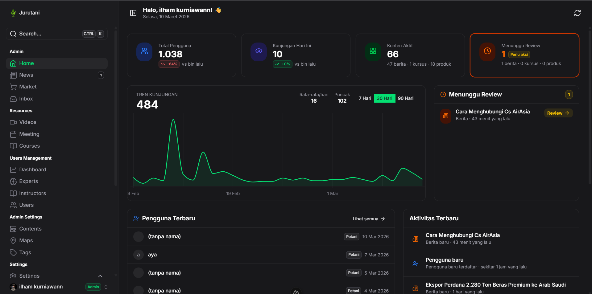

# Jurutani Admin Dashboard

[](https://ui.nuxt.com)
[](https://nuxt.com)
[](https://supabase.com)
[](https://www.typescriptlang.org)

Dashboard admin terpadu untuk platform **Jurutani** — sistem informasi pertanian yang menghubungkan petani, pakar, dan sumber daya pertanian Indonesia.



---

## 🚀 Tech Stack

| Teknologi | Versi | Kegunaan |
|---|---|---|
| **Nuxt 4** | v4.3.1 | Full-stack Vue framework |
| **Nuxt UI 4** | v4.5.1 | Component library (Tailwind CSS v4) |
| **Supabase** | latest | Database, Auth, Storage |
| **Zod** | v4.3.6 | Schema validation |
| **TypeScript** | strict | Static type checking |
| **pnpm** | latest | Package manager |

---

## ✨ Fitur

### 📊 Dashboard & Analitik
- Statistik pengguna, konten, dan aktivitas platform
- Grafik registrasi & distribusi role pengguna

### 📰 Manajemen Konten
- **Berita** — buat, edit, publish/reject berita dengan kategori
- **Konten** — kelola banner dan carousel halaman utama
- **Tags** — manajemen kategori untuk berita, pasar, dan pakar

### 📚 Kursus (Learning)
- Buat dan kelola kursus beserta lesson bertingkat
- Editor konten rich-text (TipTap) dengan embed YouTube, Google Drive
- Preview kursus: lesson, progres, komentar, rating bintang
- Drag-and-drop reorder lesson
- Publish workflow dengan status (pending → approved)

### 🛒 Pasar
- Manajemen produk marketplace pertanian
- Review & moderasi listing produk

### 👥 Manajemen Pengguna
- Daftar pengguna dengan filter role
- Manajemen pakar & instruktur
- Dashboard statistik per pengguna

### 📥 Inbox & Notifikasi
- Pesan masuk dari pengguna
- Badge unread real-time di sidebar

### 📅 Meeting
- Jadwal dan manajemen pertemuan virtual

### 🗺️ Maps & Lokasi
- Peta sebaran pengguna/lokasi

### ⚙️ Pengaturan
- Profil admin, anggota tim, notifikasi, keamanan

### 🤖 AI Asisten
- Chatbot AI terintegrasi (sidebar & floating panel)
- Tanya seputar platform Jurutani

### 🔐 Autentikasi
- Sign in dengan email/password atau Google OAuth
- Halaman login dengan animasi canvas dinamis + glassmorphism

---

## 📁 Struktur Project

```
app/
├── components/       # Vue components (per fitur)
├── composables/      # Reusable logic (useAuth, useChatbot, dll.)
├── layouts/          # Nuxt layouts (default, auth, plain)
├── pages/            # File-based routing
├── stores/           # Pinia stores
├── types/            # TypeScript types + Supabase generated types
└── utils/            # Utility functions
server/
└── api/              # Server API routes
supabase/
└── migrations/       # Database migrations
mcp-server/           # MCP Server untuk GitHub Copilot
```

---

## ⚡ Quick Start

### 1. Install Dependencies

```bash
pnpm install
```

### 2. Setup Environment Variables

Buat file `.env` di root project:

```env
SUPABASE_URL=your_supabase_url
SUPABASE_KEY=your_supabase_anon_key
SUPABASE_SERVICE_KEY=your_supabase_service_key
```

### 3. Generate Supabase Types

```bash
pnpm types:generate
```

### 4. Jalankan Dev Server

```bash
pnpm dev
```

Buka `http://localhost:3000`

---

## 🛠️ Scripts

```bash
pnpm dev              # Development server
pnpm build            # Build production
pnpm preview          # Preview production build
pnpm lint             # ESLint
pnpm typecheck        # TypeScript check
pnpm types:generate   # Generate Supabase types
```

---

## 🤖 MCP Server (GitHub Copilot)

Project ini dilengkapi MCP Server untuk meningkatkan pengalaman GitHub Copilot dengan konteks codebase Jurutani.

```bash
cd mcp-server
pnpm install
```

Restart VS Code setelah setup. Lihat [MCP_SETUP.md](./MCP_SETUP.md) untuk detail lengkap.

---

## 📖 Dokumentasi

- [MCP Setup Guide](./MCP_SETUP.md) — Setup MCP Server untuk GitHub Copilot
- [Copilot Instructions](./copilot-instructions.md) — Coding standards & best practices

---

## 👨‍💻 Developer

Dibuat dengan ❤️ oleh **Ilham Kurniawan**

[](https://ilhamkrnwan.vercel.app)
[](https://github.com/ilhamkrnwan)

Check out the [deployment documentation](https://nuxt.com/docs/getting-started/deployment) for more information.

## Renovate integration

Install [Renovate GitHub app](https://github.com/apps/renovate/installations/select_target) on your repository and you are good to go.
